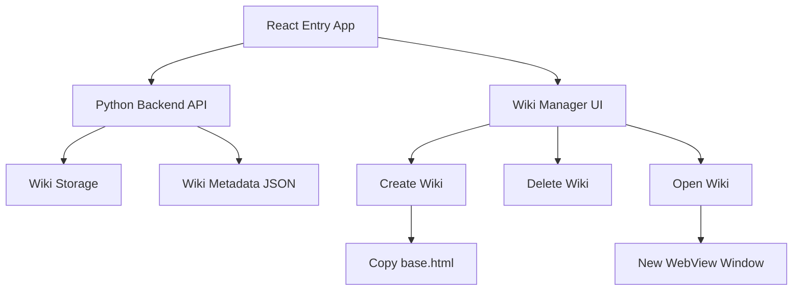

# Multi-Wiki TiddlyWiki Architecture

## Overview
Transform the current single-wiki pywebview application into a multi-wiki system with a React-based entry page for wiki management.

## Current State Analysis
- **Current Setup**: Simple pywebview app showing [`empty.html`](src/assets/empty.html) TiddlyWiki file
- **Assets**: [`empty.html`](src/assets/empty.html) and [`base.html`](src/assets/base.html) TiddlyWiki files
- **Main Entry**: [`src/main.py`](src/main.py) creates single webview window

## Architecture Design

### System Components



### File Structure
```
src/
├── main.py                    # Main application entry point
├── api/
│   ├── __init__.py
│   ├── wiki_manager.py        # Wiki CRUD operations
│   └── window_manager.py      # Multi-window management
├── assets/
│   ├── base.html              # Read-only TiddlyWiki template
│   ├── empty.html             # Legacy file (can be removed)
│   └── react-app/            # React entry application
│       ├── index.html
│       ├── src/
│       │   ├── App.js
│       │   ├── components/
│       │   │   ├── WikiList.js
│       │   │   ├── CreateWikiForm.js
│       │   │   └── WikiCard.js
│       │   └── utils/
│       │       └── api.js
│       └── package.json
├── data/
│   ├── wikis.json            # Wiki metadata persistence
│   └── wikis/                # Wiki storage directory
│       ├── wiki_001.html     # Generated wiki files
│       ├── wiki_002.html
│       └── ...
└── utils/
    ├── __init__.py
    └── file_utils.py         # File operations utilities
```

## Data Models

### Wiki Metadata Schema
```json
{
  "wikis": [
    {
      "id": "unique_uuid",
      "name": "User Provided Name",
      "description": "User provided description",
      "filename": "wiki_001.html",
      "created_at": "2026-01-03T13:47:00Z",
      "last_opened": "2026-01-03T14:30:00Z",
      "file_size": 2048576
    }
  ],
  "settings": {
    "last_wiki_id": 3,
    "default_wiki": null
  }
}
```

### API Interface Design

#### Wiki Management API
- `create_wiki(name, description)` → Creates new wiki from [`base.html`](src/assets/base.html)
- `delete_wiki(wiki_id)` → Removes wiki file and metadata
- `list_wikis()` → Returns all wiki metadata
- `get_wiki(wiki_id)` → Returns specific wiki metadata
- `open_wiki(wiki_id)` → Opens wiki in new window

#### Window Management API
- `create_wiki_window(wiki_path)` → Creates new webview window
- `close_wiki_window(window_id)` → Closes specific wiki window
- `list_open_windows()` → Returns active wiki windows
- `focus_window(window_id)` → Brings window to front

## React App Architecture

### Component Hierarchy
```
App
├── Header
├── WikiList
│   └── WikiCard[]
├── CreateWikiForm
└── Footer
```

### Key Features
- **Wiki List View**: Grid/list of existing wikis with metadata
- **Create New Wiki**: Form with name and description fields
- **Wiki Actions**: Open, Delete, Rename actions per wiki
- **Search/Filter**: Filter wikis by name or description
- **Settings**: Basic app configuration

## Multi-Window Strategy

### Desktop Implementation (macOS/Windows/Linux)
- Use pywebview's multi-window capability
- Each wiki opens in separate webview window
- Main React app remains as manager/launcher
- Windows can be closed independently

### Mobile Implementation (Android)
- **Challenge**: Mobile platforms typically single-window
- **Solution Options**:
  1. **Tab-based**: Switch between wikis within single window
  2. **Activity Stack**: Use Android activity system for wiki switching
  3. **Hybrid**: Main app + embedded wiki viewer component

### Recommended Mobile Approach
- Keep React app as main interface
- Embed TiddlyWiki in iframe/webview component within React
- Use React routing to switch between wiki manager and wiki viewer
- Add "Back to Manager" button in wiki view

## Implementation Phases

### Phase 1: Backend Foundation
1. Create wiki management API
2. Implement file operations (copy, delete)
3. Design metadata persistence
4. Basic multi-window support

### Phase 2: React Frontend
1. Set up React development environment
2. Create basic UI components
3. Implement wiki CRUD operations
4. Connect to Python backend API

### Phase 3: Integration & Polish
1. Integrate React app with pywebview
2. Test multi-window functionality
3. Handle edge cases and error states
4. Mobile compatibility testing

### Phase 4: Advanced Features
1. Wiki import/export
2. Wiki templates beyond base.html
3. Backup and sync capabilities
4. Advanced search and organization

## Technical Considerations

### PyWebView Integration
- React app will be served as the main window content
- Communication via pywebview's JavaScript bridge
- API calls from React → Python backend via exposed functions

### File Management
- [`base.html`](src/assets/base.html) remains read-only template
- Wiki copies stored in `data/wikis/` directory
- Unique filename generation (UUID-based)
- Atomic file operations for reliability

### Cross-Platform Compatibility
- File path handling (Windows vs Unix)
- Directory creation and permissions
- Window management differences per OS
- Mobile-specific adaptations

### Security Considerations
- Validate user input for wiki names/descriptions
- Sanitize file paths and names
- Prevent directory traversal attacks
- Safe file deletion with confirmation

## Development Dependencies

### Python Packages
- `pywebview` (existing)
- `uuid` (built-in)
- `json` (built-in)
- `shutil` (built-in)
- `pathlib` (built-in)

### React/JavaScript
- `react`
- `react-dom`
- `axios` (for API calls, if needed)
- Build tools: `webpack`, `babel`

## Testing Strategy
- Unit tests for wiki management functions
- Integration tests for React-Python communication
- Cross-platform testing on desktop
- Mobile platform testing (Android focus)
- User acceptance testing for workflow

## Deployment Considerations
- Bundle React app for production
- Package all dependencies with pywebview
- Handle asset paths in different environments
- Distribution for desktop and mobile platforms

This architecture provides a scalable foundation for the multi-wiki system while maintaining compatibility across platforms and providing a modern user interface for wiki management.